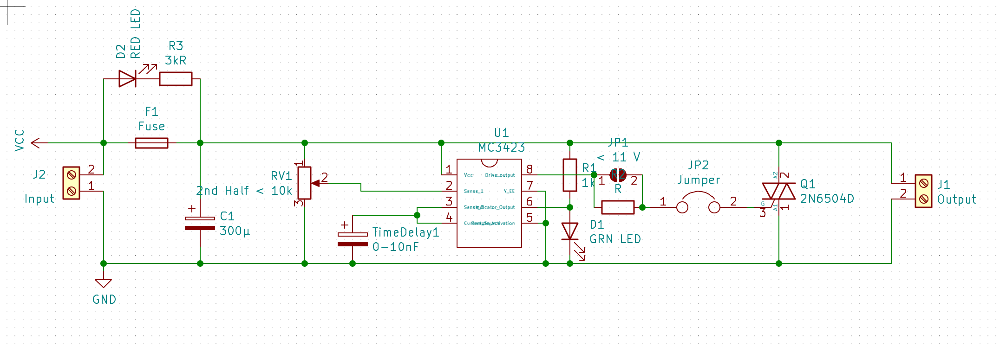
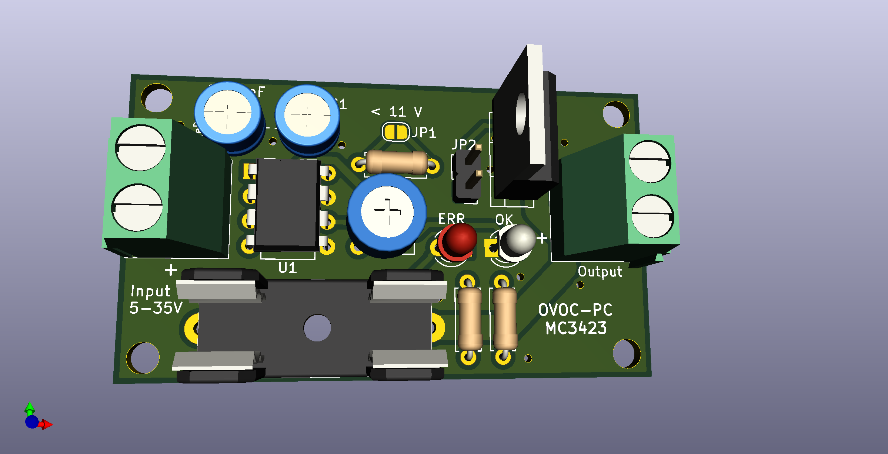

# Overview
Overvoltage and Overcurrent protection PCB based on the MC3423 chip and a thyristor.
To "calibrate" the cutoff voltage, disconnect jumper `JP2`, apply the desired (over-) voltage and turn potentiometer until green LED `D1` turns off.

### Renderings

### BOM

|ID |Bezeichner|Gehäuse                                         |Stückzahl|Bezeichnung   |Anbieter und Referenz|
|---|----------|------------------------------------------------|---------|--------------|---------------------|
|1  |D2        |LED_D3.0mm                                      |1        |RED LED       |                     |
|2  |U1        |DIP-8_W7.62mm                                   |1        |MC3423        | https://www.aliexpress.com/item/32265024406.html |
|3  |Q1        |TO-220-3_Vertical                               |1        |2N6504D       | https://www.aliexpress.com/item/1005001367101161.html |
|4  |JP2       |Pin_Header_Straight_1x02_Pitch2.54mm            |1        |Jumper        |                     |
|5  |JP1       |SolderJumper-2_P1.3mm_Open_RoundedPad1.0x1.5mm  |1        |< 11 V        |                     |
|6  |TimeDelay |CP_Radial_D5.0mm_P2.50mm                        |1        |0-10nF        |                     |
|7  |RV1       |Potentiometer_Trimmer_ACP_CA6v_Horizontal       |1        |2nd Half < 10k| https://www.aliexpress.com/item/4000096355520.html |
|8  |R3        |R_Axial_DIN0207_L6.3mm_D2.5mm_P7.62mm_Horizontal|1        |3kR           |                     |
|9  |R2        |R_Axial_DIN0207_L6.3mm_D2.5mm_P7.62mm_Horizontal|1        |R             |                     |
|10 |R1        |R_Axial_DIN0207_L6.3mm_D2.5mm_P7.62mm_Horizontal|1        |1k            |                     |
|11 |J2        |TerminalBlock_Phoenix_MKDS1.5-2pol              |1        |Input         |                     |
|12 |J1        |TerminalBlock_Phoenix_MKDS1.5-2pol              |1        |Output        |                     |
|13 |F1        |Fuseholder5x20_horiz_open_Schurter_0031_8201    |1        |Fuse          | https://www.aliexpress.com/item/32749978743.html |
|14 |D1        |LED_D3.0mm                                      |1        |GRN LED       |                     |
|15 |C1        |CP_Radial_D5.0mm_P2.50mm                        |1        |300µ          |                     |
